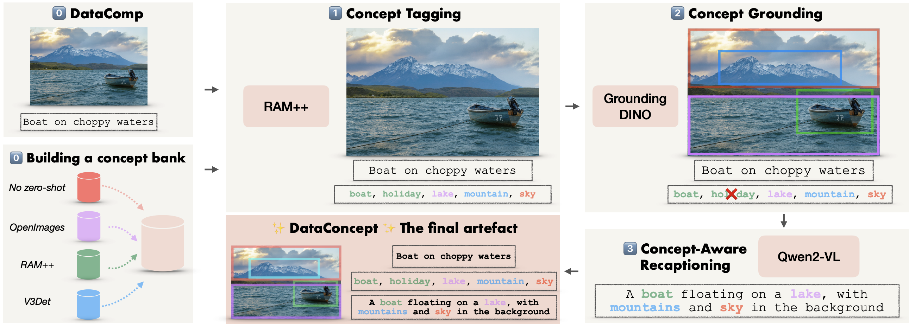

# CABS: Concept-Aware Batch Sampling

*A flexible data-centric approach to train better CLIP/SigLIP models and better vision encoders for VLMs.*

This is the official codebase for the paper [Concept-Aware Batch Sampling Improves Language-Image Pretraining](https://arxiv.org/pdf/2511.20643) by [Adhiraj Ghosh](https://adhirajghosh.github.io/), [Vishaal Udandarao](http://vishaal27.github.io/)\*, [Thao Nguyen](https://thaonguyen19.github.io/)\*, [Matteo Farina](https://farinamatteo.github.io/)\*, [Mehdi Cherti](https://mehdidc.github.io/), [Jenia Jitsev](https://orcid.org/0000-0002-1221-7851), [Sewoong Oh](https://homes.cs.washington.edu/~sewoong/), [Elisa Ricci](http://eliricci.eu/), [Ludwig Schmidt](https://people.csail.mit.edu/ludwigs/), [Matthias Bethge](https://scholar.google.com/citations?user=0z0fNxUAAAAJ).

## Contents

- [CABS Checkpoints](#cabs-checkpoints)
- [DataConcept Annotation Pipeline](#dataconcept-annotation-pipeline)
  - [Data Format](#data-format)
  - [Setup](#setup)
  - [Running Bounding Box Annotation](#running-bounding-box-annotation)
  - [Running Recaptioning](#running-recaptioning)
- [Training With CABS](#training-with-cabs)
- [Citation](#citation)
- [Acknowledgements](#acknowledgements)
- [Contact](#contact)

## CABS Checkpoints

*Will be updated soon.*

All CABS variants are trained with a filter ratio (e.g. 0.8), indicated in the table below. We find that 0.8 is the best ratio for both Diversity Maximisation (CABS-DM) and Frequency-Maximisation (CABS-FM).

| Model | Architecture | CABS | Caption | Link |
|-------|-------------|------|---------|------|
| CLIP | ViT-B/32 | CABS-DM (0.8) | Alt-text | [🤗](https://huggingface.co/bethgelab/ViT-B-32_cabs-dm_alt_0.8) |
| CLIP | ViT-B/32 | CABS-DM (0.8) | Recap | [🤗](https://huggingface.co/bethgelab/ViT-B-32_cabs-dm_recap_0.8) |
| CLIP | ViT-B/32 | CABS-FM (0.8) | Alt-text | [🤗](https://huggingface.co/bethgelab/ViT-B-32_cabs-fm_alt_0.8) |
| CLIP | ViT-B/32 | CABS-FM (0.8) | Recap | [🤗](https://huggingface.co/bethgelab/ViT-B-32_cabs-fm_recap_0.8) |

Model usage can be found in [model_usage.py](model_usage.py).

Note: if you require the checkpoints as .pt files, please let us know. 

## DataConcept Annotation Pipeline



The DataConcept pipeline enriches image-text datasets with sample-level annotations in three stages:

1. **RAM++ tagging** — open-set image tagging using [RAM++](https://github.com/xinyu1205/recognize-anything) with a Swin-L backbone. Produces per-image tags and confidence scores.

2. **GroundingDINO detection** — grounded object detection using [GroundingDINO](https://github.com/IDEA-Research/GroundingDINO) conditioned on the RAM++ tags. Runs at multiple image scales with weighted box fusion to produce high-quality bounding boxes and class labels.

3. **Qwen2-VL recaptioning** — recaption images using [Qwen2-VL-7B-Instruct](https://huggingface.co/Qwen/Qwen2-VL-7B-Instruct), guided by both the original alt-text and the detected object classes. The VLM is loaded via HuggingFace Transformers, so you can easily swap in a newer or larger model.

We release [DataConcept_128M](https://huggingface.co/datasets/bethgelab/dataconcept_128M), a large-scale dataset annotated with this pipeline. We would appreciate the community's help in converting more image-text datasets into DataConcept-style pretraining datasets with sample-level concept annotations and bounding boxes.

### Data Format

DataConcept follows the [DataComp](https://www.datacomp.ai/) protocol and uses the [WebDataset](https://github.com/webdataset/webdataset) format. Each sample is stored as a set of files sharing the same key:

```
<key>.jpg   # image
<key>.txt   # alt-text caption
<key>.json  # metadata (bounding boxes, classes, etc.)
```

Samples are grouped into sequentially numbered tar shards (`00000.tar`, `00001.tar`, ...). Both the detection and captioning scripts accept `--chunk_start` and `--chunk_end` arguments to specify the range of tar shards to process, making it easy to parallelise annotation across multiple jobs.

### Setup

Create a dedicated environment for the DataConcept pipeline:

```bash
conda create -n dataconcept python=3.10
conda activate dataconcept
pip install -r requirements_dataconcept.txt
```

Then install GroundingDINO (requires CUDA 11.8 and GCC <= 11):

```bash
cd dataconcept/detection
git clone https://github.com/IDEA-Research/GroundingDINO.git
cd GroundingDINO
pip install -e .
```

See [dataconcept/detection/README.md](dataconcept/detection/README.md) for detailed GroundingDINO installation troubleshooting.

For recaptioning with Qwen2-VL, install [FlashAttention-2](https://github.com/Dao-AILab/flash-attention) for faster inference:

```bash
pip install flash-attn --no-build-isolation
```

### Running Bounding Box Annotation

Download the required model checkpoints:
- `ram_plus_swin_large_14m.pth` from the [RAM++ repo](https://github.com/xinyu1205/recognize-anything)
- `groundingdino_swinb.pth` from the [GroundingDINO repo](https://github.com/IDEA-Research/GroundingDINO)


```bash
cd dataconcept/detection

python ensemble_boxes.py \
    --load_path /path/to/tar/shards \
    --chunk_start 00000 \
    --chunk_end 00010 \
    --class_jsons data/vocabulary_descriptions.json \
    --ram_checkpoint /path/to/ram_plus_swin_large_14m.pth \
    --grounded_checkpoint /path/to/groundingdino_swinb.pth \
    --config GroundingDINO/groundingdino/config/GroundingDINO_SwinB.py \
    --features_dir /path/to/features \
    --results_dir /path/to/results
```

### Running Recaptioning

```bash
cd dataconcept/captioning

python recap.py \
    --load_path /path/to/tar/shards \
    --chunk_start 00000 \
    --chunk_end 00010 \
    --results_dir /path/to/results
```

## Training With CABS

The training code in `src/open_clip_train/` extends [open_clip](https://github.com/mlfoundations/open_clip) with CABS. We advise you first create a virtual environment:

```bash
cd cabs
python3.12 -m venv .env
source .env/bin/activate
pip install -U pip
```

You can then install the package for training with:

```bash
pip install -e '.[training]'
```

We provide example SLURM scripts in [scripts/](scripts/). For instance, see [scripts/cabs-dm/vitb32_alt_0.8.sh](scripts/cabs-dm/vitb32_alt_0.8.sh) for training a ViT-B/32 with CABS-DM at a filter ratio of 0.8.

### Key Parameters

- `--which-sampling`: Sampling strategy. Use `"filter"` for CABS or `"iid"` for standard training.
- `--cabs-dm` / `--cabs-freq`: Enable CABS-DM (diversity maximisation) or CABS-FM (frequency maximisation).
- `--captions`: Caption source. Use `"alt"` for original DataComp alt-text or `"recap"` for DataConcept recaptions.
- `--filter-ratio`: Fraction of each super-batch to keep after concept-aware filtering (e.g. `0.8`).
- `--batch-size`: Per-GPU **super-batch** size (before filtering).
- `--epochs`: Number of training epochs (adjusted for filtering overhead).

### Relating Batch Size, Epochs, And Filter Ratio

CABS loads a larger super-batch, filters out a fraction of samples, and passes the remaining sub-batch to the model. The filter ratio controls this relationship:

```
sub-batch size (per GPU) = super-batch size * (1 - filter_ratio)
```

**Example** — to pass 4096 samples to the model per step on 4 GPUs (1024 per device):

```
super-batch size per GPU = sub-batch / (1 - filter_ratio)
                         = 1024 / (1 - 0.8)
                         = 1024 / 0.2
                         = 5120          → --batch-size 5120
```

Since only `(1 - filter_ratio)` of each super-batch is used for training, the number of epochs must be scaled up accordingly to see the same number of effective training samples:

```
epochs = 1 / (1 - filter_ratio)
       = 1 / 0.2
       = 5                              → --epochs 5
```

See `params.py` for all available CLI arguments.

## Citation
If you find this work useful to your research, please consider citing as:
```bibtex
@article{ghosh2025concept,
  title={Concept-Aware Batch Sampling Improves Language-Image Pretraining},
  author={Ghosh, Adhiraj and Udandarao, Vishaal and Nguyen, Thao and Farina, Matteo and Cherti, Mehdi and Jitsev, Jenia and Oh, Sewoong and Ricci, Elisa and Schmidt, Ludwig and Bethge, Matthias},
  journal={arXiv preprint arXiv:2511.20643},
  year={2025}
}
```

## Acknowledgements
The training code is adapted from [open_clip](https://github.com/mlfoundations/open_clip). The DataConcept pipeline builds on [RAM++](https://github.com/xinyu1205/recognize-anything), [GroundingDINO](https://github.com/IDEA-Research/GroundingDINO), and [Qwen2-VL](https://arxiv.org/abs/2409.12191). We train and evaluate on data from [DataComp](https://www.datacomp.ai/). We thank the authors of these projects and the broader open-source community for making large-scale vision-language research accessible.

## Contact
Please feel free to open an issue or email us at [adhiraj.ghosh@bethgelab.org](mailto:adhiraj.ghosh@bethgelab.org).